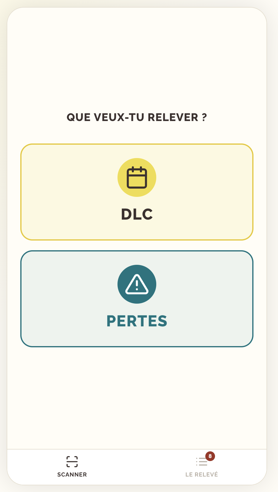
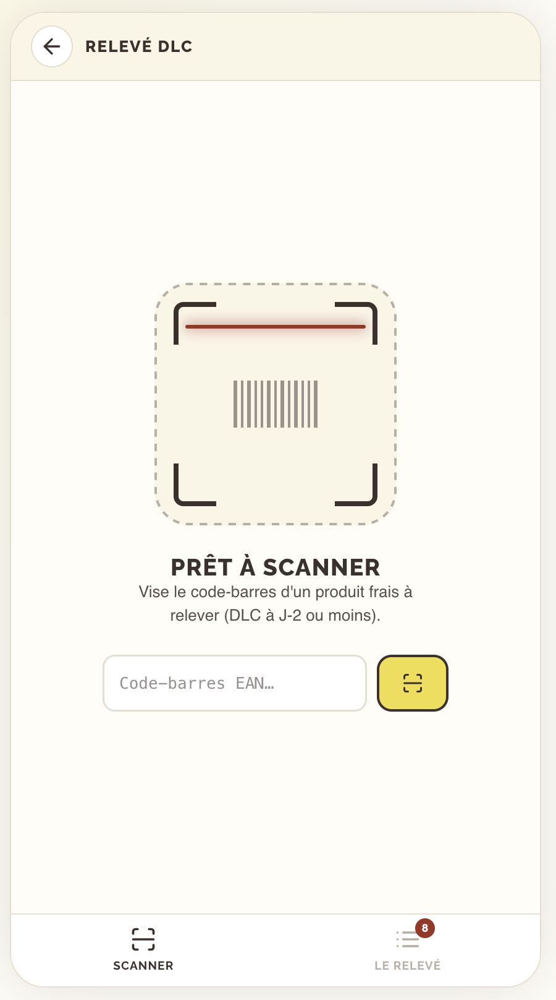
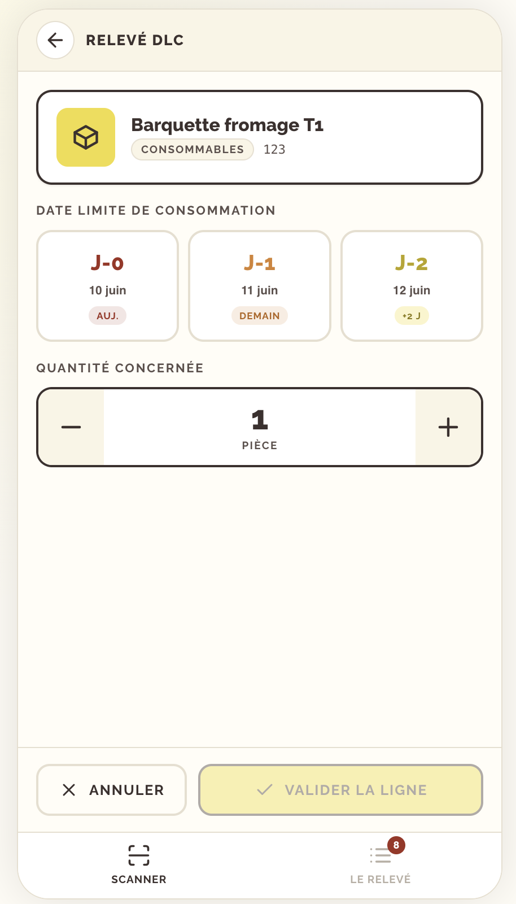
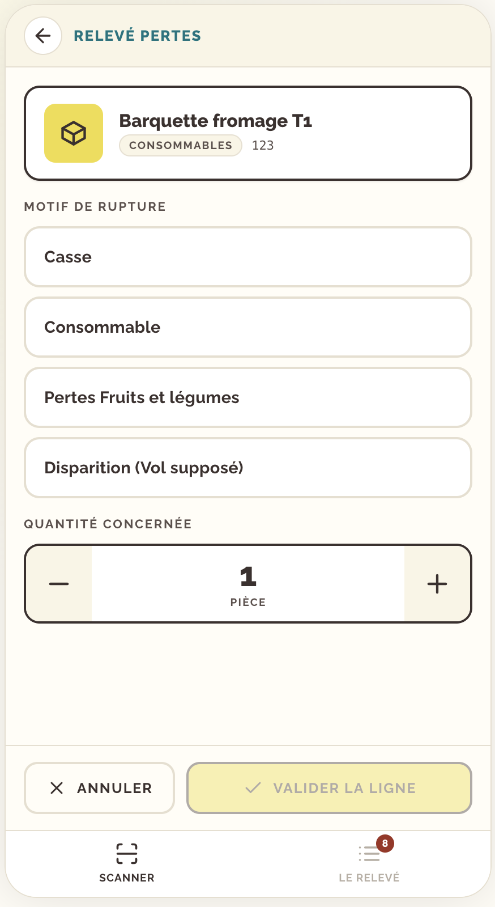
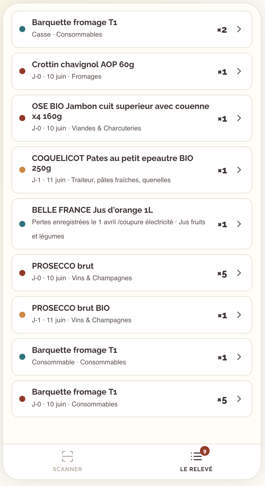
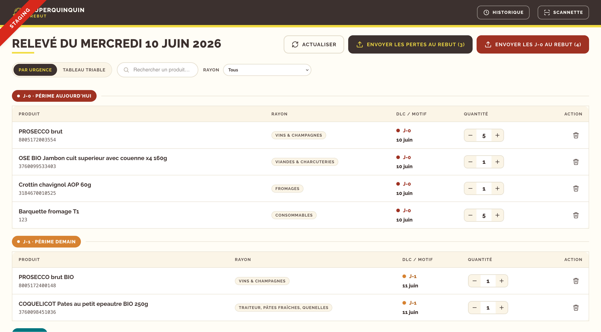

# Rebut — SuperQuinquin

Application de relevé des DLC (dates limites de consommation) et des pertes, puis
d'envoi automatique au rebut dans Odoo.

Chaque jour, les coopérateur-ices scannent en rayon les produits proches de leur date limite ou
abîmés ; le ou la salarié-e consulte le relevé du jour depuis son poste, puis envoie les
produits concernés au rebut dans Odoo.

---

## 1. Pas à pas

### Côté rayon — la scannette

1. **Choisir le type de relevé.** À l'ouverture, la scannette demande quoi relever :
   `DLC` ou `Pertes`.

   

2. **Scanner le produit.** L'écran « prêt à scanner » attend une lecture. Visez le
   code-barres : un bip confirme la reconnaissance du produit.

   

3a. **Si c'est une DLC** : choisissez l'urgence (J-0 / J-1 / J-2) ou une date exacte,
   ajustez la quantité (ou le poids), puis **Valider la ligne**.

   

3b. **Si c'est une perte** : choisissez le **motif**, ajustez la quantité, puis
   **Valider la ligne**.

   

4. **Vérifier le relevé.** L'onglet *Le relevé* liste tout ce qui a été saisi.
   Touchez une ligne pour modifier sa quantité/son motif ou la supprimer.

   

### Côté poste — le responsable

5. **Consulter le relevé du jour.** Vue *Par urgence* (groupes J-0 / J-1 / J-2 puis
   Pertes). Recherchez un produit, filtrez par rayon, ajustez les quantités.

   

6**Envoyer au rebut.** Cliquez sur *Envoyer les pertes au rebut* ou *Envoyer les J-0
   au rebut*. Un récapitulatif s'affiche ; confirmez pour créer les ordres de rebut dans
   Odoo.

7**Retrouver les relevés passés** depuis l'*Historique*.

---

## 2. Développement local

### Pré-requis

- **JDK 21**
- **Node.js 22** (le front est buildé par le Maven via Quinoa, et tourne en dev sur Vite)
- **Docker** — Quarkus Dev Services démarre automatiquement une base PostgreSQL le temps
  du `dev` ; aucune base à installer à la main.

### Configuration Odoo (`.env` à la racine)

```
ODOO_URL=...            ODOO_DATABASE=...    ODOO_LOGIN=...    ODOO_PASSWORD=...
ODOO_BASIC_AUTH_USERNAME=...   ODOO_BASIC_AUTH_PASSWORD=...   # staging uniquement (couche HTTP Basic Auth en plus du login)
```

> ⚠️ `odoo.rebut.dry-run` vaut **`true`** par défaut partout (aucune écriture Odoo, le
> payload est seulement loggé) — garde-fou anti-écriture accidentelle. Pour tester le
> **vrai** rebut **sur staging** : `./mvnw quarkus:dev -Dodoo.rebut.dry-run=false`.

### Lancer en local

```shell
./mvnw quarkus:dev
```

L'app est alors accessible sur http://localhost:8080 (le serveur Vite du front tourne en
arrière-plan sur le port 5173 et est servi via Quarkus).

---

## 3. Déploiement

### Lancer le conteneur

L'application a besoin d'une **base PostgreSQL** (les migrations Flyway sont jouées au
démarrage) et de l'accès à **Odoo**. À configurer via variables d'environnement :

```shell
docker run --rm -p 8080:8080 \
  -e QUARKUS_DATASOURCE_JDBC_URL="jdbc:postgresql://<host>:5432/<db>" \
  -e QUARKUS_DATASOURCE_USERNAME="<user>" \
  -e QUARKUS_DATASOURCE_PASSWORD="<password>" \
  -e ODOO_URL="https://odoo.example.com" \
  -e ODOO_DATABASE="<db_odoo>" \
  -e ODOO_LOGIN="<login>" \
  -e ODOO_PASSWORD="<password>" \
  -e ODOO_REBUT_DRY_RUN="false" \
  ghcr.io/<org>/<repo>:latest
```

> En production, pensez à passer `ODOO_REBUT_DRY_RUN=false` (sinon les rebuts ne sont que
> simulés) et `APP_STAGING=false` (pour masquer le bandeau « Staging »).

Healtcheck disponible sur `GET /q/health` (Quarkus SmallRye Health)
---

## 5. Installer sur le terminal Zebra (PWA)

L'application est une **PWA** : elle s'installe sur l'écran d'accueil du terminal

### Pré-requis

- Le terminal Zebra doit accéder à l'URL de l'application **en HTTPS** (les PWA ne
  s'installent qu'en contexte sécurisé) et disposer d'un **navigateur Chrome** récent.
- Le scanner intégré doit envoyer les codes en **émulation clavier (keystroke)** : via
  **DataWedge**, créez/activez un profil pour Chrome avec la sortie *Keystroke* activée.
  L'app gère le scan comme une saisie clavier et masque le clavier virtuel pour ne pas
  gêner.

### Installation

1. Ouvrez **Chrome** sur le terminal et rendez-vous sur l'URL de l'application.
2. Ouvrez le menu **⋮** de Chrome → **Installer l'application** (ou *Ajouter à l'écran
   d'accueil*).
3. Confirmez : l'icône **Rebut** apparaît sur l'écran d'accueil.
4. Lancez l'app depuis cette icône : elle s'ouvre en plein écran, en portrait.
